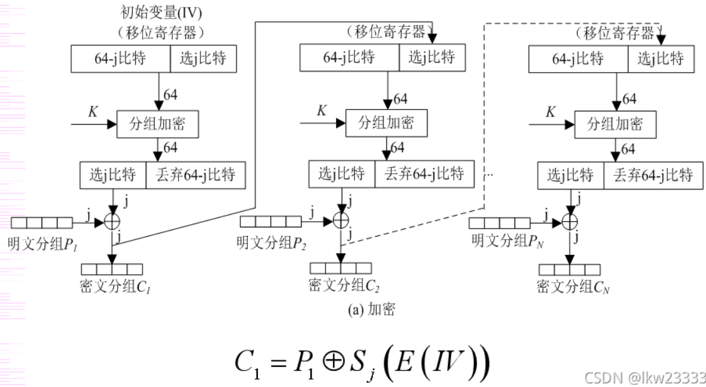

## Re方向writeup

所有的源码、exe和idb都开源在 https://github.com/nen9mA0/NKU_CTF-2022-RE

### Signin

#### 解题过程

签到题，符号表都没去

直接IDA F5即可

##### main函数

```c
int __cdecl main(int argc, const char **argv, const char **envp)
{
  size_t v3; // rdx
  char *Str; // [rsp+28h] [rbp-8h]

  _main(argc, argv, envp);			// mingw编译时自动加入的一个函数，用来执行一些初始化的构造函数
  puts("Input Flag:");
  scanf("%s", flag);
  if ( strlen(flag) != 38 )			// 读入flag，判断长度
  {
    puts("Try again!");
    exit(0);
  }
  Str = (char *)base(flag);			// 核心算法，实际上是一个base64
  v3 = strlen(Str);
  if ( !memcmp(Str, cmp, v3) )		// 比较算法结果
    puts("Congratulation!");
  else
    puts("Try again!");
  return 0;
}
```

##### base函数

```c
void *__fastcall base(const char *a1)
{
  char v2; // [rsp+24h] [rbp-1Ch]
  char v3; // [rsp+25h] [rbp-1Bh]
  char v4; // [rsp+26h] [rbp-1Ah]
  void *v5; // [rsp+28h] [rbp-18h]
  int v6; // [rsp+30h] [rbp-10h]
  int v7; // [rsp+34h] [rbp-Ch]
  int v8; // [rsp+38h] [rbp-8h]
  int v9; // [rsp+3Ch] [rbp-4h]

  v7 = strlen(a1);
  v6 = 4 * (v7 / 3 + 1);
    // 编码后的缓冲区大小，这可以算作base64的一个特征，因为base64的本质就是把3字节编码为4字节（3*8 => 4*6）
  v5 = malloc(v6);
  memset(v5, 0, v6);				// 申请解密后的内存块
  v9 = 0;
  v8 = 0;
  while ( v9 < v6 )					// base64核心算法，下面具体解释
  {
    v4 = ((16 * a1[v8]) | (a1[v8 + 1] >> 4)) & 0x3F;
    v3 = ((4 * a1[v8 + 1]) | (a1[v8 + 2] >> 6)) & 0x3F;
    v2 = a1[v8 + 2] & 0x3F;
    *((_BYTE *)v5 + v9) = table[(unsigned __int8)a1[v8] >> 2];
    *((_BYTE *)v5 + v9 + 1) = table[v4];
    *((_BYTE *)v5 + v9 + 2) = table[v3];
    *((_BYTE *)v5 + v9 + 3) = table[v2];
    v9 += 4;
    v8 += 3;
  }
    // 下面用来判断是否需要补等号
  if ( v7 % 3 == 1 )
  {
    *((_BYTE *)v5 + v9 - 2) = '=';
    *((_BYTE *)v5 + v9 - 1) = '=';
    *((_BYTE *)v5 + v9) = 0;
  }
  else if ( v7 % 3 == 2 )
  {
    *((_BYTE *)v5 + v9 - 1) = '=';
    *((_BYTE *)v5 + v9) = 0;
  }
  else
  {
    *((_BYTE *)v5 + v9 - 4) = 0;
  }
  return v5;
```

这里有个小技巧，可以看到上面反编译的源码里存在一些强制类型转换，很影响代码阅读，这是因为IDA没有正确推断出变量的类型。我们可以手动来定义变量的类型

* 首先应该判断是哪个变量的类型被推断错了，注意到含有强制类型转换的地方，如 `*((_BYTE *)v5 + v9)` 都包含v5和v9两个变量，其中v5是`void*`，v9是int，从前面的代码也可以知道，v5用于接受malloc的参数，所以类型自动视作一个`void*`指针

* 接下来应该看强制转换成的类型是什么，这里是 `_BYTE*` ，所以我们可以确定，这里应该是v5的类型错误，本应是 `_BYTE*`（即`char*`）

* 在IDA中点击v5这个变量，按下y，更改类型

  

更改后，反编译的代码就变成这样啦

```c
char *__fastcall base(const char *a1)
{
  char v2; // [rsp+24h] [rbp-1Ch]
  char v3; // [rsp+25h] [rbp-1Bh]
  char v4; // [rsp+26h] [rbp-1Ah]
  _BYTE *v5; // [rsp+28h] [rbp-18h]
  int v6; // [rsp+30h] [rbp-10h]
  int v7; // [rsp+34h] [rbp-Ch]
  int v8; // [rsp+38h] [rbp-8h]
  int v9; // [rsp+3Ch] [rbp-4h]

  v7 = strlen(a1);
  v6 = 4 * (v7 / 3 + 1);
  v5 = malloc(v6);
  memset(v5, 0, v6);
  v9 = 0;
  v8 = 0;
  while ( v9 < v6 )
  {
    v4 = ((16 * a1[v8]) | (a1[v8 + 1] >> 4)) & 0x3F;
    v3 = ((4 * a1[v8 + 1]) | (a1[v8 + 2] >> 6)) & 0x3F;
    v2 = a1[v8 + 2] & 0x3F;
    v5[v9] = table[(unsigned __int8)a1[v8] >> 2];
    v5[v9 + 1] = table[v4];
    v5[v9 + 2] = table[v3];
    v5[v9 + 3] = table[v2];
    v9 += 4;
    v8 += 3;
  }
  if ( v7 % 3 == 1 )
  {
    v5[v9 - 2] = '=';
    v5[v9 - 1] = '=';
    v5[v9] = 0;
  }
  else if ( v7 % 3 == 2 )
  {
    v5[v9 - 1] = '=';
    v5[v9] = 0;
  }
  else
  {
    v5[v9 - 4] = 0;
  }
  return v5;
}
```

此外，还可以点击变量按n对变量进行重命名，这里不赘述

##### 算法分析

这个算法的核心就是base64编码，只不过我把编码的表调换了一下顺序，具体算法原理大家可以去查一下，大概做的事情如下图


这里将输入的flag base64编码后的结果与Cmp变量进行比较

```c
if ( !memcmp(Str, cmp, v3) )
  puts("Congratulation!");
else
  puts("Try again!");
```

其中Cmp为

```
.data:0000000000403060 cmp             db 'mZOemISImpOckJKaoIuQoI2aiZqNjJaRmKCakZiWkZqajZaRmIL=',0
```

因此要得到正确flag，应该实现一个base64的解码程序，将Cmp解码即可得到结果

#### exp

```python
import base64

# 这个base64换表的方法来自 https://stackoverflow.com/questions/5537750/decode-base64-like-string-with-different-index-tables

my_base64chars  = "/+9876543210zyxwvutsrqponmlkjihgfedcbaZYXWVUTSRQPONMLKJIHGFEDCBA"
std_base64chars = "ABCDEFGHIJKLMNOPQRSTUVWXYZabcdefghijklmnopqrstuvwxyz0123456789+/"

s = "mZOemISImpOckJKaoIuQoI2aiZqNjJaRmKCakZiWkZqajZaRmIL="

trans = my_base64chars.maketrans(my_base64chars, std_base64chars)
s = s.translate(trans)
data = base64.b64decode(s)
print(data)
```

#### flag

```
flag{welcome_to_reversing_engineering}
```

### TheMatrix

#### 解题过程

这题把符号表去掉了，但核心框架和前一题差不多

##### main函数

```c
int __cdecl main(int argc, const char **argv, const char **envp)
{
  void *Buf1; // [rsp+20h] [rbp-60h]
  int i; // [rsp+2Ch] [rbp-54h]

  sub_401850(argc, argv, envp);			// 对应前一题的_main，是编译器自动插入的
  puts("Input Flag:");
  scanf("%s", Str);
  if ( strlen(Str) != 36 )				// 读入flag，判断长度
  {
    puts("Try Again!");
    exit(0);
  }
  for ( i = 0; i < strlen(Str); ++i )
    dword_407A00[i] = Str[i];			// 将输入的flag放到一个全局变量
  Buf1 = (void *)sub_401550(&unk_403020, dword_407A00, 6i64);	// 核心算法
  if ( !memcmp(Buf1, &unk_4030C0, 0x90ui64) )	// 比较算法结果
    puts("Congratulation!");
  else
    puts("Try Again!");
  return 0;
}
```

##### 核心算法

核心算法如下，注意这里使用了上题提到的算法对变量和参数类型进行了修改，具体如何判断大家可以自己尝试一下

```c
int *__fastcall sub_401550(DWORD *a1, DWORD *a2, int a3)
{
  int *v4; // [rsp+28h] [rbp-18h]
  int k; // [rsp+34h] [rbp-Ch]
  int j; // [rsp+38h] [rbp-8h]
  int i; // [rsp+3Ch] [rbp-4h]

  v4 = (int *)malloc(4i64 * a3 * a3);
  memset(v4, 0, 4i64 * a3 * a3);
  for ( i = 0; i < a3; ++i )
  {
    for ( j = 0; j < a3; ++j )
    {
      for ( k = 0; k < a3; ++k )
        v4[j + a3 * i] += a2[j + a3 * k] * a1[k + a3 * i];
    }
  }
  return v4;
}
```

这个算法实际上是一个矩阵乘法，a1和a2是两个要相乘的矩阵，a3是矩阵的阶数

##### 算法分析

而从前面的main函数代码可以看出，unk_403020这个地址的矩阵（为了方便，看作A）与输入的矩阵（看作B）进行相乘，最后结果与unk_4030C0这个地址的矩阵（看作C）进行比较，即

所以要得到flag只需要求 $A^{-1} C$

#### exp

```python
import numpy as np

a = [
        [0x35, 0x63, 0x3A, 0x4D, 0x59, 0x1A],
        [0x51, 0x0D, 0x46, 0x45,  0x4, 0x59],
        [0x0C, 0x45, 0x3B, 0x4D, 0x3C, 0x11],
        [0x3C, 0x4B, 0x24, 0x48, 0x32, 0x1B],
        [0x39, 0x62, 0x55, 0x5C,  0x0, 0x2D],
        [0x41, 0x2A, 0x47, 0x49, 0x1C, 0x1B]
]

c = [
        [0xa349,0x9a73,0xa225,0x8ea9,0x96d1,0x98ff],
        [0x8470,0x8061,0x73ff,0x6eb4,0x6b8c,0x832e],
        [0x77e5,0x6e5e,0x7964,0x69dc,0x6a22,0x7149],
        [0x80cb,0x7ac2,0x7e9f,0x71bf,0x7972,0x7998],
        [0x99ee,0x9026,0x91f3,0x8122,0x87f6,0x9912],
        [0x7d15,0x7549,0x7a84,0x7024,0x6fdb,0x75c2]
]

A = np.array(a)
C = np.array(c)

inv_A = np.linalg.inv(A)
B = np.matmul(inv_A, C)

lst = list(np.reshape(B, (1,-1))[0])

flag = []
for i in lst:
    tmp = int(round(i))
    flag.append(chr(tmp))

print("".join(flag))
```

#### flag

```
flag{The_Answer_Is_Out_There_Neo...}
```

### block_cipher

#### 解题过程

这题的框架也与前几题很类似。题目名block_cipher说明是个分组加密算法，关于分组加密的一些知识可以查一下资料。

##### main函数

```c
int __cdecl main(int argc, const char **argv, const char **envp)
{
  size_t v4; // [rsp+20h] [rbp-10h] BYREF
  char *Buf1; // [rsp+28h] [rbp-8h]

  sub_401930(argc, argv, envp);
  puts("Input Flag:");
  scanf("%s", Str);
  v4 = strlen(Str);
  Buf1 = sub_4016F9(Str, &v4);				// 核心算法1
  sub_401630(Buf1, v4);						// 核心算法2
  if ( !memcmp(Buf1, &unk_403040, 0x28ui64) ) // 比较算法结果
    puts("Congratulation!");
  else
    puts("Try again!");
  free(Buf1);
  return 0;
}
```

##### 核心算法1

```c
char *__fastcall sub_4016F9(const void *Str, _QWORD *p_len)
{
  int v2; // eax
  char *v4; // [rsp+28h] [rbp-18h]
  int pad_num; // [rsp+30h] [rbp-10h]
  int new_len; // [rsp+34h] [rbp-Ch]
  int len; // [rsp+38h] [rbp-8h]
  int i; // [rsp+3Ch] [rbp-4h]

  len = *p_len;
  new_len = 8 * (len / 8 + 1);		// 若len是8的倍数，则new_len为len+8，否则new_len为大于len的最小的8的倍数
  if ( (len & 7) != 0 )
    v2 = 8 - len % 8;				// 若len不是8的倍数，则pad_num为其与8的倍数的差
  else
    v2 = 8;							// 否则pad_num为8
  pad_num = v2;
  v4 = (char *)malloc(new_len);
  memcpy(v4, Str, len);				// 新生成的内存，前面len为先前输入的内容
  for ( i = 0; i < pad_num; ++i )
    v4[len + i] = pad_num;			// 后面由pad_num补齐到8的倍数
  *p_len = new_len;
  return v4;
}
```

其实这个是分组加密的pkcs5算法，因为分组加密是按组来加密，所以若块的长度达不到分组长度，则需要进行padding

##### 核心算法2

```c
__int64 __fastcall sub_401630(char *buf1, unsigned __int64 len)
{
  __int64 result; // rax
  int v3; // [rsp+2Ch] [rbp-14h]
  int v4; // [rsp+30h] [rbp-10h]
  int v5; // [rsp+34h] [rbp-Ch] BYREF
  int v6; // [rsp+38h] [rbp-8h]
  int i; // [rsp+3Ch] [rbp-4h]

  v3 = dword_403020;			// 初始化两个值，这两个值实际上是IV
  v4 = dword_403024;
  for ( i = 0; ; i += 8 )		// 每次加密8字节，即分组长度为64b
  {
    result = i;
    if ( len <= i )
      break;					// 若加密完成，则退出
    v5 = *(_DWORD *)&buf1[i];	 	// 取前4字节
    v6 = *(_DWORD *)&buf1[i + 4];	// 取后4字节
    v5 ^= v3;
    v6 ^= v4;					// 与IV相与
    sub_401550((unsigned int *)&v5, dword_403028);	// 加密
    v3 = v5;					// 新的IV值为加密后的值
    v4 = v6;
    *(_DWORD *)&buf1[i] = v5;	// 将加密后的结果放回传入的buf中
    *(_DWORD *)&buf1[i + 4] = v6;
  }
  return result;
}
```

实际上这里实现的算法是分组加密的CBC模式，具体可以查资料，大概的操作如下图


##### 加密算法

加密算法如下

```c
_DWORD *__fastcall sub_401550(unsigned int *a1, _DWORD *a2)
{
  _DWORD *result; // rax
  int i; // [rsp+20h] [rbp-10h]
  int v4; // [rsp+24h] [rbp-Ch]
  unsigned int v5; // [rsp+28h] [rbp-8h]
  unsigned int v6; // [rsp+2Ch] [rbp-4h]

  v6 = *a1;
  v5 = a1[1];
  v4 = 0;
  for ( i = 0; i <= 31; ++i )
  {
    v4 -= 0x61C88647;
    v6 += (v5 + v4) ^ (*a2 + 16 * v5) ^ ((v5 >> 5) + a2[1]);
    v5 += (v6 + v4) ^ (a2[2] + 16 * v6) ^ ((v6 >> 5) + a2[3]);
  }
  *a1 = v6;
  result = a1 + 1;
  a1[1] = v5;
  return result;
}
```

对于加密算法的逆向，一般来说手写出逆向结果还是有一些困难的，有一个好办法是查找算法的常数。因为加密算法一般都会使用到一些常数，如这里的0x61C88647，一般可以通过这些常数快速知道使用的加密算法类型。但对于一些常数被修改的算法，一般就只能通过代码的结构来判断了，说白了就是凭经验和感觉。

此外这里有一个有趣的现象：IDA逆向出的结果是 `v4 -= 0x61C88647` ，但实际上我源码里写的是 `sum += 0x9e3779b9` ，两个数互为补码，这里应该是编译器优化导致的，所以在查常数的时候如果没找到可以试着找找它的补码。

通过查找和比较代码，可以知道该算法是TEA算法，所以算法的总体流程为

* 获取输入，使用pkcs5进行padding
* 加密，使用CBC模式和TEA算法
* 对加密结果进行比较

所以这里对加密结果使用CBC和TEA算法进行解密即可

#### exp

```python
import ctypes

cipher = [0x35e938c1,0xda99481,0x81d66cc8,0xf191766f,0x9f32984,0xf6dde5be,0x4b19af9,0xa4d20c70,0x15cc4772,0xe90392c8]
iv = [0xdeadbeef, 0xcafebabe]
key = [0x5a5aa5a5, 0xa5a55a5a, 0x00000000, 0x00000000]

def decrypt_block(block, key):
    v0 = ctypes.c_uint32(block[0])
    v1 = ctypes.c_uint32(block[1])

    delta = 0x9e3779b9
    sum = ctypes.c_uint32(delta*32)

    for i in range(32):
        v1.value -= ( (v0.value<<4) + key[2] ) ^ (v0.value + sum.value) ^ ( (v0.value>>5) + key[3] )
        v0.value -= ( (v1.value<<4) + key[0] ) ^ (v1.value + sum.value) ^ ( (v1.value>>5) + key[1] )
        sum.value -= delta

    return v0.value, v1.value


def decrypt(cipher, key):
    cipher_len = len(cipher)
    v = [0, 0]
    iv_tmp = [0, 0]

    v[0] = cipher[0]
    v[1] = cipher[1]
    iv_tmp[0] = v[0]
    iv_tmp[1] = v[1]

    v[0], v[1] = decrypt_block(v, key)
    v[0] ^= iv[0]
    v[1] ^= iv[1]

    cipher[0] = v[0]
    cipher[1] = v[1]

    for i in range(2, cipher_len, 2):
        v[0] = cipher[i]
        v[1] = cipher[i+1]
        v[0], v[1] = decrypt_block(v, key)
        v[0] ^= iv_tmp[0]
        v[1] ^= iv_tmp[1]

        iv_tmp[0] = cipher[i]
        iv_tmp[1] = cipher[i+1]
        cipher[i] = v[0]
        cipher[i+1] = v[1]


decrypt(cipher, key)
for i in cipher:
        tmp = i
        print("%c" %(tmp&0xff), end="")
        print("%c" %((tmp>>8)&0xff), end="")
        print("%c" %((tmp>>16)&0xff), end="")
        print("%c" %((tmp>>24)&0xff), end="")
```

#### flag

```
flag{It_has_been_3_o_clock_TEA_first!}
```

#### PS

这里我谢个罪，写的时候忘了TEA的key是128位的，然后我其实代码里只给了64位的key，后面64位是编译器填的0x00

### easy_packer

#### 解题过程

这题主要是想让大家练习一下手动脱壳，于是用了常见的UPX壳，为了防止直接被-d解壳我把加壳后的程序中的UPX字段给改掉了，但有同学知道这个小技巧，又把它改回来就可以正常脱壳了 （，这个算我的锅。

软件保护壳的大体概念如下图


所以若直接载入IDA查看，只能看到解壳程序（或者叫Unpacking Routine），而真正运行的程序是被压缩/加密保护起来的。因此要找到真正运行的程序需要动态调试到达解壳完毕的时候才可以看到。解壳程序解压缩/解密完毕后程序指针会跳转到程序的起始位置开始运行，也叫作程序的OEP（Original Entry Point 原始入口点），脱壳的关键就是找到这个OEP。

对于本题来说，要找到原始程序的内容比较简单，因为程序在运行时通过scanf读入flag，此时程序必定已经解压缩完毕，所以在读入的时候通过调试器暂停一下程序，再通过调用栈找到scanf的调用点，将这部分内存dump下来即可，如下图所示，这里我用到的调试器是x64dbg

* 在程序等待输入的时候按下暂停，因为此时等待输入的并非程序的主线程，所以仍需要输入一些内容才能真正使程序暂停下来

  

* 此时查看程序的调用堆栈，可以定位到scanf的调用点

  

* 可以看到这个地方就是解密后的代码

  

* 在上方选项卡选择插件->Scylla->File->Dump Memory，找到代码所在的段

  

* 点击dump后保存文件

接下来可以用IDA载入这个内存文件，但注意此时的文件并没有完整的PE结构，因为由上面软件壳的构成可以看出，这里运行原程序并不需要程序的PE结构，因此这段内存中可能只包含了原程序的代码和数据。

此外还需要注意，使用IDA载入后由于缺乏PE头的信息，程序的基址默认为0，可以从Edit->Segments->Rebase Program将基址调整为正确的0x401000

进行简单调整后，就可以看一下对应刚刚调用scanf处的程序，地址是401825


这里可以看到，反编译的结果非常混乱，IDA似乎无法识别被调用的这些函数，这是因为加壳后的程序中，导入表（IAT）是在运行时被还原的，所以IDA无法分析导入的函数，这里只能通过动态调试来还原被调用的函数（其实脱壳的重要一环就是重建IAT，但这里我们不需要还原一个可以运行的未加壳程序，因此就不考虑重建IAT了）

可以通过一一对应的方式来区分各个函数


##### main函数

修复后的代码如下，结构实际上与前几题都很类似

```c
__int64 sub_4017F6()
{
  unsigned int v0; // eax
  __int64 v2; // [rsp+28h] [rbp-8h]

  sub_401990();
  ((void (__fastcall *)(const char *))puts)("Input Flag:");
  ((void (*)(const char *, ...))scanf)("%s", &qword_408968[35]);	// 输入flag
  v2 = ((__int64 (__fastcall *)(__int64 *))strlen)(&qword_408968[35]);
  if ( v2 != 36 )												// 判断flag长度
  {
    ((void (__fastcall *)(const char *))puts)("Try again!");
    ((void (__fastcall *)(_QWORD))exit)(0i64);
  }
  v0 = ((__int64 (__fastcall *)(const char *))strlen)("nkctf_1s_Am4z1ng");
  sub_401550((__int64)&qword_408968[3], (__int64)"nkctf_1s_Am4z1ng", v0);
    		// 对nkctf_1s_Am4z1ng字符串进行一系列操作，实际上是用这个key初始化一个映射表
  sub_4016C8((__int64)&qword_408968[3], (__int64)&qword_408968[35], v2);
    		// 使用映射表对输入的flag进行加密
  if ( !(unsigned int)((__int64 (__fastcall *)(__int64 *, void *, __int64))memcmp)(
                        &qword_408968[35],
                        &unk_404020,
                        36i64) )
      		// 比较加密后结果
    ((void (__fastcall *)(const char *))puts)("Congratulation!");
  else
    ((void (__fastcall *)(const char *))puts)("Try again!");
  return 0i64;
}
```

可以看到主要的算法集中于 401550 和 4016C8 两个函数

##### sub_401550

```c
__int64 __fastcall sub_401550(unsigned __int8 *table, unsigned __int8 *a2, unsigned int a3)
{
  __int64 result; // rax
  char v4[259]; // [rsp+0h] [rbp-80h]
  unsigned __int8 v5; // [rsp+103h] [rbp+83h]
  int j; // [rsp+104h] [rbp+84h]
  int i; // [rsp+108h] [rbp+88h]
  int v8; // [rsp+10Ch] [rbp+8Ch]

  v8 = 0;
  v5 = 0;
    // a1数组填充0~255，v4数组反复填充输入的a2到256个元素
  for ( i = 0; i <= 255; ++i )
  {
    table[i] = i;
    result = i;
    v4[i] = a2[i % a3];
  }
    // 从0开始，对a1的元素根据算出的下标进行交换，一共交换256次
  for ( j = 0; j <= 255; ++j )
  {
    v8 = (v4[j] + a1[j] + v8) % 256;
    v5 = table[j];
    table[j] = table[v8];
    result = v5;
    table[v8] = v5;
  }
  return result;
}
```

从这里的算法可以看出，得到的表table只与输入的a2有关（即nkctf_1s_Am4z1ng）

##### sub_4016C8

```c
__int64 __fastcall sub_4016C8(unsigned __int8 *table, unsigned __int8 *input, unsigned int len)
{
  __int64 result; // rax
  unsigned __int8 v4; // [rsp+Fh] [rbp-11h]
  unsigned int i; // [rsp+14h] [rbp-Ch]
  int v6; // [rsp+18h] [rbp-8h]
  int v7; // [rsp+1Ch] [rbp-4h]

  v7 = 0;
  v6 = 0;
  for ( i = 0; ; ++i )
  {
    result = i;
    if ( i >= len )			// 若超出长度则break
      break;
    v7 = (v7 + 1) % 256;
    v6 = (table[v7] + v6) % 256;
    v4 = table[v7];
    table[v7] = table[v6];
    table[v6] = v4;			// 这段程序根据算出的index对表的内容进行交换
    input[i] ^= table[(unsigned __int8)(table[v7] + table[v6])];
      						// 将某个表项与输入进行异或
  }
  return result;
}
```

从上述算法可以看出几点

* 主要的交换操作都只与table的内容有关，input并不改变table的内容
* input最后只与table的某个项进行了异或

##### 算法分析

实际上上面采用的算法是RC4流密码算法。但由上述分析可得，由于input只与表进行了异或，且表的内容与input无关，实际上我们只需要构造一张同样的表，复制这份算法即可。另一个思路就是因为input是异或运算得到结果，所以把要比较的结果作为输入的话得到的就是flag本身。又或者有个简单粗暴的方法，因为这里的算法是按字节异或，所以可以直接爆破得到flag。

#### exp

```python
a = [0xa0,0x57,0x33,0x25,0x31,0x1a,0xe6,0xe1,0x2,0x70,0xb,0x1d,0x92,0xac,0x85,0x88,0x9f,0x8b,0x6f,0x6e,0x43,0x5d,0xd5,0xb0,0x73,0x46,0x6d,0x73,0x87,0x7,0x19,0xb8,0x20,0xa5,0x9,0x64]

init_str = "nkctf_1s_Am4z1ng"

def init(mystr):
    table1 = []
    table2 = []
    mylen = len(mystr)
    for i in range(256):
        table1.append(i)
        table2.append( ord(mystr[i % mylen]) )

    v8 = 0
    for i in range(256):
        v8 = (table1[i] + table2[i] + v8) % 256
        tmp = table1[i]
        table1[i] = table1[v8]
        table1[v8] = tmp
    return table1

def encrypt(table, myinput):
    result = []
    input_len = len(myinput)

    v6 = 0
    v7 = 0
    for i in range(input_len):
        v7 = (v7 + 1) % 256
        v6 = (table[v7] + v6) % 256
        tmp = table[v7]
        table[v7] = table[v6]
        table[v6] = tmp

        result.append( chr( myinput[i] ^ table[ (table[v7] + table[v6]) % 256 ] ) )

    return result

table = init(init_str)
result = encrypt(table, a)
print("".join(result))
```

#### flag

```
flag{N0w_Y0u_Kn0w_Wh4t_1s_P4ck3r!!!}
```

### AntiDisasm

#### 解题过程

这题主要考察的是如何绕过一些花指令和反调试

##### main函数

一样可以先试着F5

```c
int __cdecl __noreturn main(int argc, const char **argv, const char **envp)
{
  size_t v3; // [rsp+28h] [rbp-18h] BYREF
  void *Buf1; // [rsp+30h] [rbp-10h]
  void *Buf2; // [rsp+38h] [rbp-8h]

  sub_401B70(argc, argv, envp);
  Buf2 = 0i64;
  puts("Input Flag:");
  scanf("%s", Str);
  v3 = strlen(Str);					// 输入flag
  if ( (unsigned int)sub_401550() )	 // 这里有个检测，如果不通过就退出
    exit(-1);
  Buf1 = (void *)sub_401862(Str, &v3);	// 这里将输入进行了一些处理
  sub_4016DB(Buf1, v3);				// 此后将前面处理的结果再进行了一次处理
  JUMPOUT(0x401A62i64);				// 这里就明显是有花指令导致反编译出错
}
```

先看main中的JUMPOUT处代码

```asm
.text:0000000000401A2C                 call    loc_401A62
.text:0000000000401A31 ; ---------------------------------------------------------------------------
.text:0000000000401A31
.text:0000000000401A31 loc_401A31:                             ; CODE XREF: main+C1↓j
.text:0000000000401A31 E9                                 db 0E9h	; 这里的E9是为了让反汇编器将这段数据识别为jmp指令
.text:0000000000401A32 46                                            db  46h ; F
.text:0000000000401A33 9A                                            db  9Ah
.text:0000000000401A34 81                                            db  81h
.text:0000000000401A35 CC                                            db 0CCh
.text:0000000000401A36 F6 67                                         dw 67F6h
.text:0000000000401A38 DF E0 9A 95 1C 03 0F 48 AA 12+                dq 480F031C959AE0DFh, 0CD8E6124829512AAh, 20A4FD605666CF40h
.text:0000000000401A38 95 82 24 61 8E CD 40 CF 66 56+                dq 0FA9722734C197314h, 2FAA870335D599EAh
.text:0000000000401A60 A4 44                                         db 0A4h, 44h
.text:0000000000401A62 ; ---------------------------------------------------------------------------
.text:0000000000401A62
.text:0000000000401A62 loc_401A62:                             ; CODE XREF: main+87↑p
.text:0000000000401A62                 push    rax				; 保存rax寄存器
.text:0000000000401A63                 xor     rax, rax
.text:0000000000401A66                 jnz     short loc_401A31	; 这里构造了一个伪跳转，因为xor rax, rax的结果ZF必为0
.text:0000000000401A68                 pop     rax				; 恢复rax寄存器
.text:0000000000401A69                 pop     rax		; 注意这个地方，现在栈上的内容是401A2C处的call压入的返回地址
.text:0000000000401A6A                 inc     rax		; 对rax加一，注意上一条的返回地址应是401A31，所以现在rax=401A32
.text:0000000000401A6D                 mov     [rbp+Buf2], rax
.text:0000000000401A71                 mov     rdx, [rbp+Buf2] ; Buf2
.text:0000000000401A75                 mov     rax, [rbp+Buf1]
.text:0000000000401A79                 mov     r8d, 30h ; '0'  ; Size
.text:0000000000401A7F                 mov     rcx, rax        ; Buf1
.text:0000000000401A82                 call    memcmp	; 调用memcmp对Buf1和401A32开始的48字节进行比较
.text:0000000000401A87                 test    eax, eax
.text:0000000000401A89                 jnz     short loc_401A99
.text:0000000000401A8B                 lea     rcx, aCongratulation ; "Congratulation!"	; 若相同则打印
.text:0000000000401A92                 call    puts
.text:0000000000401A97                 jmp     short loc_401AA5
.text:0000000000401A99 ; ---------------------------------------------------------------------------
.text:0000000000401A99
.text:0000000000401A99 loc_401A99:                             ; CODE XREF: main+E4↑j
.text:0000000000401A99                 lea     rcx, aTryAgain  ; "Try again!"		; 若不同则打印
.text:0000000000401AA0                 call    puts
.text:0000000000401AA5
.text:0000000000401AA5 loc_401AA5:                             ; CODE XREF: main+F2↑j
.text:0000000000401AA5                 mov     rax, [rbp+Buf1]
.text:0000000000401AA9                 mov     rcx, rax        ; Block
.text:0000000000401AAC                 call    free
.text:0000000000401AB1                 mov     eax, 0
.text:0000000000401AB6                 add     rsp, 40h
.text:0000000000401ABA                 pop     rbp
.text:0000000000401ABB                 retn
.text:0000000000401ABB main            endp
```

可以看到这里与前几题一样是比较加密后的内容是否与一段数据相同，但注意这里被比较的数据是写在代码段中的，同时通过花指令让反汇编器误以为这段数据是代码。

这里如果要修复为可以反编译代码比较困难，因为memcmp的第二段内存地址是通过call指令的返回地址来获取的。所以这里不尝试修复，只需要知道这里memcmp是比较计算结果和401A32开始的48字节

##### sub_401550 反调试

先来看这个检测

```c
_BOOL8 sub_401550()
{
  if ( (_BYTE)IsDebuggerPresent == 0xCC )
    return 1i64;
  if ( (_BYTE)IsDebuggerPresent == 0xE9 )
    return 1i64;
  return IsDebuggerPresent();
}
```

这里其实是一个很简单的反调试检测，调用了函数IsDebuggerPresent，当该进程被调试器调试时，该函数返回True。而前两个判断分别是检测在函数入口处是否存在int3断点或者hook（jmp语句的第一个字节是E9），算是两个对反反调试的简单对抗。

##### sub_401862

```asm
.text:0000000000401862                               sub_401862      proc near               ; CODE XREF: main+6E↓p
.text:0000000000401862                                                                       ; DATA XREF: .pdata:0000000000406084↓o ...
.text:0000000000401862
.text:0000000000401862                               arg_0           = qword ptr  10h
.text:0000000000401862                               arg_8           = qword ptr  18h
.text:0000000000401862
.text:0000000000401862 55                                            push    rbp
.text:0000000000401863 48 89 E5                                      mov     rbp, rsp
.text:0000000000401866 48 83 EC 40                                   sub     rsp, 40h
.text:000000000040186A 48 89 4D 10                                   mov     [rbp+arg_0], rcx
.text:000000000040186E 48 89 55 18                                   mov     [rbp+arg_8], rdx
.text:0000000000401872 48 8B 45 18                                   mov     rax, [rbp+arg_8]
.text:0000000000401876 48 8B 00                                      mov     rax, [rax]
.text:0000000000401879
.text:0000000000401879                               loc_401879:                             ; CODE XREF: sub_401862:loc_401879↑j
.text:0000000000401879 EB FF                                         jmp     short near ptr loc_401879+1
```

###### 花指令形式1

这里其实利用的花指令形式是jmp到下一个字节，因为jmp指令本身包含2字节，而反汇编器无法处理这种指令存在重叠的情况。修复方法很简单，将第一个字节nop掉即可，可以看到

```asm
.text:0000000000401879 90                                            nop
.text:000000000040187A FF C0                                         inc     eax
.text:000000000040187C FF C8                                         dec     eax
```

即，这段花指令实际上是这样构成的

```asm
jmp +1
inc eax
dec eax
```

可以直接修改为等价形式

```asm
nop
inc eax
dec eax
```

或者全部nop掉。

所以得到第一个patch规则：更改序列

```
EB FF C0 FF C8  --->  90 90 90 90 90
```

###### 花指令形式2

下面的40188B出现了第二种形式的花指令

```asm
.text:0000000000401884 50                                            push    rax
.text:0000000000401885
.text:0000000000401885                               loc_401885:                             ; CODE XREF: sub_401862+29↓j
.text:0000000000401885 66 B8 EB 05                                   mov     ax, 5EBh
.text:0000000000401889 31 C0                                         xor     eax, eax
.text:000000000040188B 74 FA                                         jz      short near ptr loc_401885+2
.text:000000000040188D E8 58 8D 50 07                                call    near ptr 790A5EAh
.text:0000000000401892 85 C0                                         test    eax, eax
.text:0000000000401894 0F 48 C2                                      cmovs   eax, edx
.text:0000000000401897 C1 F8 03                                      sar     eax, 3
.text:000000000040189A 83 C0 01                                      add     eax, 1
```

可以先记录正常执行的序列

```asm
push rax
mov ax, 5EBh
xor eax, eax
jz			; 注意这里是个永真的跳转
```

然后使用u将401885处的反汇编取消定义还原为数据，再从401887处按c进行反汇编

```asm
.text:0000000000401887 EB 05                                         jmp     short loc_40188E
.text:0000000000401887                               ; -------------------------------------------------------------
.text:0000000000401889 31                                            db  31h ; 1
.text:000000000040188A C0                                            db 0C0h
.text:000000000040188B 74                                            db  74h ; t
.text:000000000040188C FA                                            db 0FAh
.text:000000000040188D E8                                            db 0E8h
.text:000000000040188E                               ; -------------------------------------------------------------
.text:000000000040188E
.text:000000000040188E                               loc_40188E:                             ; CODE XREF: sub_401862+25↑j
.text:000000000040188E 58                                            pop     rax
```

由此可以得到真正执行的指令序列

```asm
push rax
mov ax, 5EBh
xor eax, eax
jz -6
jmp 5
pop rax
```

实际上这段花指令更清晰的描述如下（图中jz -7应为-6），此外这里加上了对rax的保存和还原


所以得到第二种patch规则，全部nop掉即可

```
66 B8 EB 05 31 C0 74 FA E8 -> 90 90 90 90 90 90 90 90 90
```

这里我是用 [idapython脚本](https://github.com/nen9mA0/MyIDAPython/blob/master/patch_bytes.py) patch的，配置文件如下

```json
{
    "type": "pattern",
    "pattern":
    [
        {
            "type": "hex",
            "original": "EB FF C0 FF C8",
            "changed": "90 90 90 90 90",
            "enable": true
        },
        {
            "type": "hex",
            "original": "50 66 B8 EB 05 31 C0 74 FA E8 58",
            "changed": "90 90 90 90 90 90 90 90 90 90 90",
            "enable": true
        }
    ],
    "segments":[
        ".text"
    ]
}
```

###### 花指令形式3

试图对401862进行反编译，出现报错 `positive sp value has been detected, the output may be wrong!` ，这说明函数的栈是不平衡的，一般说明存在其他的花指令。于是继续分析。

可以看到ret前的指令序列与一般的函数是不同的

```asm
.text:00000000004018B0                 push    rax			; 压入rax
.text:00000000004018B1                 push    rbx			; 压入rbx
.text:00000000004018B2                 mov     rax, 4018CAh
.text:00000000004018B9                 mov     rbx, 401902h
.text:00000000004018C0                 cmovz   rax, rbx		; 注意这里使用了cmovz，当ZF为0时rax才等于rbx，否则保持原样
.text:00000000004018C4                 pop     rbx			; 弹出rbx
.text:00000000004018C5                 xchg    rax, [rsp+48h+var_48]	; 这里跟栈顶元素进行了交换，是关键点
.text:00000000004018C9                 retn					; 弹出栈顶地址
```

这段代码其实实现的是jz的功能，当zf=0时，跳转到4018CA（其实就是ret下面的地址），否则跳转到401902，跳转采用了往栈上压入一个地址后ret的方法

所以可以将这一段替换为一个 `jz short 401902` ，这里我也是手动patch的，推荐用 [keypatch](https://github.com/keystone-engine/keypatch) 插件进行patch

###### 花指令形式4

继续往下看，可以看到另一种比较奇怪的指令形式

```asm
.text:00000000004018FD 74 08                                         jz      short loc_401907
.text:00000000004018FF 75 06                                         jnz     short loc_401907
```

其实这里就是一个 `jmp loc_401907` ，但使用2个条件跳转可以让反汇编器误认为下面的数据还是指令，从而达到混淆的目的

直接替换为 `jmp loc_401907`

###### 花指令形式5

下面还有一个跟 [形式3](#花指令形式3) 很类似的花指令

```asm
.text:0000000000401975 50                                            push    rax
.text:0000000000401976 53                                            push    rbx
.text:0000000000401977 48 C7 C0 8F 19 40 00                          mov     rax, 40198Fh
.text:000000000040197E 48 C7 C3 50 19 40 00                          mov     rbx, 401950h
.text:0000000000401985 48 0F 4C C3                                   cmovl   rax, rbx
.text:0000000000401989 5B                                            pop     rbx
.text:000000000040198A 48 87 04 24                                   xchg    rax, [rsp+48h+var_48]
.text:000000000040198E C3                                            retn
```

其实只是把cmovz换成了cmovl，所以同样可以替换为jl

###### 大功告成

至此，已经把这个函数所有的花指令都修复了，可以正常f5了

```c
char *__fastcall sub_401862(__int64 a1, _QWORD *a2)
{
  int v2; // eax
  char *v4; // [rsp+30h] [rbp-18h]
  int v5; // [rsp+38h] [rbp-10h]
  int v6; // [rsp+3Ch] [rbp-Ch]
  int v7; // [rsp+40h] [rbp-8h]
  int i; // [rsp+44h] [rbp-4h]

  v7 = *a2;
  v6 = 8 * (v7 / 8 + 1);
  if ( (v7 & 7) != 0 )
    v2 = 8 - v7 % 8;
  else
    v2 = 8;
  v5 = v2;
  v4 = (char *)malloc(v6);
  memcpy(v4, (const void *)a1, v7);
  for ( i = 0; i < v5; ++i )
    v4[v7 + i] = v5;
  *a2 = v6;
  return v4;
}
```

这不就是 [block_cipher](#block_cipher) 里的pkcs5算法么

##### sub_4016DB

继续看下一个关键函数，形式1和形式2的花指令已经用前面的脚本patch过了，所以函数里多出了一堆nop

可以看到401752有 [形式4](#花指令形式4) 的花指令

```
.text:0000000000401752 0F 84 D0 00 00 00                             jz      loc_401828
.text:0000000000401758 0F 85 CA 00 00 00                             jnz     loc_401828
```

###### 花指令形式6

401841处有一个很熟悉但又有些许不同的花指令

```asm
.text:0000000000401841 50                                            push    rax
.text:0000000000401842 53                                            push    rbx
.text:0000000000401843 48 C7 C0 5B 18 40 00                          mov     rax, 40185Bh
.text:000000000040184A 48 C7 C3 5F 17 40 00                          mov     rbx, 40175Fh
.text:0000000000401851 48 0F 47 C3                                   cmova   rax, rbx
.text:0000000000401855 5B                                            pop     rbx
.text:0000000000401856 48 87 04 24                                   xchg    rax, [rsp+58h+var_58]
.text:000000000040185A C3                                            retn
```

其实就是 [形式3](#花指令形式3) 和 [形式5](#花指令形式5) 的指令，使用了cmova的形式，直接替换成ja即可

###### F5！

可以看到这里又是个套娃

```c
__int64 __fastcall sub_4016DB(DWORD *a1, unsigned __int64 a2)
{
  __int64 result; // rax
  __int64 v3; // [rsp+28h] [rbp-30h] BYREF
  int v4; // [rsp+30h] [rbp-28h] BYREF
  int v5; // [rsp+34h] [rbp-24h]
  int *v6; // [rsp+38h] [rbp-20h]
  int *v7; // [rsp+40h] [rbp-18h]
  __int64 v8; // [rsp+48h] [rbp-10h]
  int i; // [rsp+54h] [rbp-4h]

  v8 = (1 << byte_404030) - 1;		// byte_404030=0x10，所以v8=0xffff，类似一个掩码
  v7 = (int *)&v3;
  v6 = &v4;
  v3 = qword_404010;				// qword_404010=0x1234567898765432
  for ( i = 0; ; i += 8 )
  {
    result = i;
    if ( a2 <= i )
      break;
    v4 = *v7;					// 这里v7的初始值就是前面的 0x98765432和0x12345678
    v5 = v7[1];
    sub_4015A3(&v4, dword_404020);	// dword_404020    dd 1234567h, 89ABCDEFh, 0FEDCBA98h, 76543210h
    v3 = (v3 << byte_404030) | v8 & *(_QWORD *)v6;
    a1[i / 4u] ^= v4;
    a1[i / 4u + 1] ^= v5;
  }
  return result;
}
```

剩下的可以先分析玩4015A3后再回来看

##### sub_4015A3

4015A3同样存在一些花指令

###### 花指令形式7

401607的地方

```asm
.text:0000000000401607 50                                            push    rax
.text:0000000000401608 48 C7 C0 AA 16 40 00                          mov     rax, 4016AAh
.text:000000000040160F 48 87 04 24                                   xchg    rax, [rsp+38h+var_38]
.text:0000000000401613 C3                                            retn
```

似乎跟前面的形式类似，但少了cmov指令。其实仔细分析可得，这就是一个jmp 4016AA

###### F5！

```c
void __fastcall sub_4015A3(int *a1, int *a2)
{
  int i; // [rsp+20h] [rbp-10h]
  unsigned int v3; // [rsp+24h] [rbp-Ch]
  unsigned int v4; // [rsp+28h] [rbp-8h]
  unsigned int v5; // [rsp+2Ch] [rbp-4h]

  v5 = *a1;
  v4 = a1[1];
  v3 = 0;
  for ( i = 0; i <= 31; ++i )
  {
    v5 += (((v4 >> 5) ^ (16 * v4)) + v4) ^ (dword_404020[v3 & 3] + v3);
    v3 -= 0x61C88647;
    v4 += (((v5 >> 5) ^ (16 * v5)) + v5) ^ (dword_404020[(v3 >> 11) & 3] + v3);
  }
  *a1 = v5;
  a1[1] = v4;
}
```

又是熟悉的常数0x61C88647，但好像跟前面的TEA有点不同，其实这是TEA的改进算法XTEA，具体可以查一下

（PS：我发现这里我的key应该是用a2参数传的，但我写错变量名了所以直接用了全局变量，我有罪）

可以发现，加密的结果最后是传到v4的，所以可以回过头来分析v4的最后一部分

##### 算法分析

总体来看，这道题同样是对输入的字符串先进行pkcs5，再进行分组加密，分组加密算法使用的是XTEA，现在未知的部分就是分组的形式

```c
  v8 = (1 << byte_404030) - 1;
  v7 = (int *)&v3;
  v6 = &v4;
  v3 = qword_404010;
  for ( i = 0; ; i += 8 )
  {
    result = i;
    if ( a2 <= i )
      break;
    v4 = *v7;
    v5 = v7[1];
    XTEA(&v4, dword_404020);
    v3 = (v3 << byte_404030) | v8 & *(_QWORD *)v6;
    a1[i / 4u] ^= v4;
    a1[i / 4u + 1] ^= v5;
  }
```

这里需要注意，v4和v5是相邻的变量，所以实际上每次加密的是v4和v5两个值，此外v7保存的是v3的指针，v6保存的是v4的指针，所以这里对变量名进行修改会较为清晰

```c
  mask = (1 << byte_404030) - 1;
  p_v3 = (int *)&v3;
  p_v4 = v4;
  v3 = qword_404010;
  for ( i = 0; ; i += 8 )
  {
    result = i;
    if ( a2 <= i )
      break;
    v4[0] = *p_v3;
    v4[1] = p_v3[1];		// 每次加密的内容其实是v3
    sub_4015A3(v4, dword_404020);
    v3 = (v3 << byte_404030) | mask & *(_QWORD *)p_v4;
      					// 加密后，原v3左移16位，低16位由加密后内容的低16位填补，作为下次加密的内容
    a1[i / 4u] ^= v4[0];
    a1[i / 4u + 1] ^= v4[1];	// 然后使用加密后的内容对传入的密文进行异或
  }
```

其实这里实现的是分组加密的CFB模式



可以发现这种模式不论加密解密都是使用的加密算法，用于加密一个移位寄存器中的值，再跟明文异或。所以实际上将要比较的密文作为明文进行加密即可得到flag

#### exp

```python
from ctypes import *

iv = [0x98765432, 0x12345678]
mykey = [0x01234567, 0x89abcdef, 0xfedcba98, 0x76543210]
move = 16

mask64 = (1<<64)-1
mask32 = (1<<32)-1

content = [0xcc819a46,0xe0df67f6,0x31c959a,0x12aa480f,0x61248295,0xcf40cd8e,0xfd605666,0x731420a4,0x22734c19,0x99eafa97,0x870335d5,0x44a42faa]

def xtea_encrypt(v, key):
    v0, v1 = c_uint32(v[0]), c_uint32(v[1])
    delta = 0x9e3779b9

    total = c_uint32(0)

    for i in range(32):
        v0.value += ( ((v1.value << 4) ^ (v1.value >> 5)) + v1.value ) ^ (total.value + key[total.value & 3])
        total.value += delta
        v1.value += ( ((v0.value << 4) ^ (v0.value >> 5)) + v0.value ) ^ (total.value + key[(total.value >> 11) & 3])

    return v0.value, v1.value

def encrypt(content, length):
    mask = (1<<move)-1

    v = [0, 0]
    reg = [ iv[0], iv[1] ]
    for i in range(0, length, 2):
        v[0] = reg[0]
        v[1] = reg[1]

        v0_tmp, v1_tmp = xtea_encrypt(v, mykey)

        v_tmp = ( (v1_tmp<<32)|v0_tmp ) & mask64
        reg_tmp = ( (reg[1]<<32)|reg[0] ) & mask64
        reg_tmp = ( (reg_tmp << move) | (v_tmp & mask) ) & mask64

        reg[0] = reg_tmp & mask32
        reg[1] = (reg_tmp >> 32) & mask32

        content[i] = content[i] ^ v0_tmp
        content[i+1] = content[i+1] ^ v1_tmp


encrypt(content, len(content))
for i in content:
        tmp = i
        print("%c" %(tmp&0xff), end="")
        print("%c" %((tmp>>8)&0xff), end="")
        print("%c" %((tmp>>16)&0xff), end="")
        print("%c" %((tmp>>24)&0xff), end="")
```

#### flag

```
flag{0ops_Y0u_Kn0w_H0w_2_F1x_Th3_Thunk_C0de}
```


